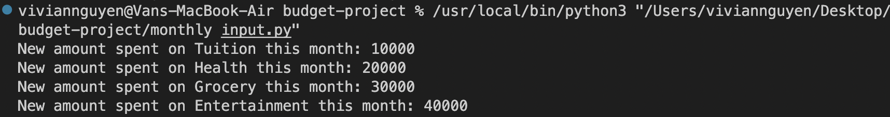
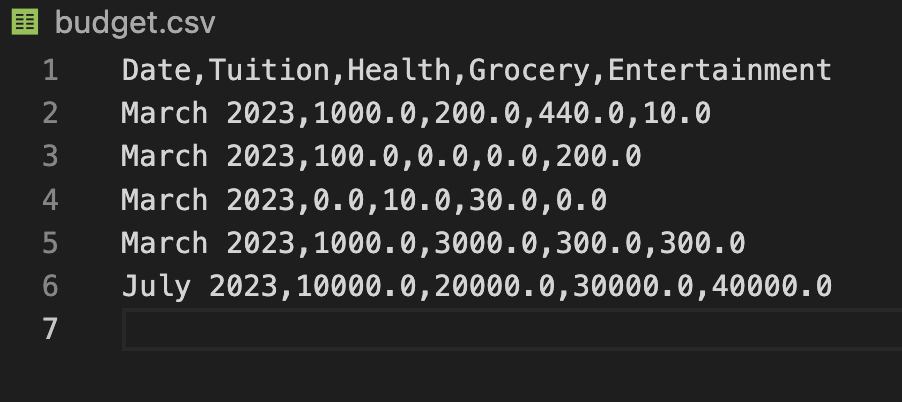
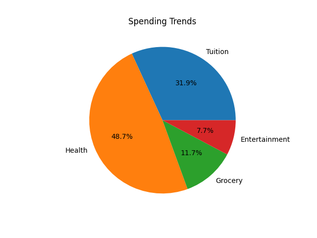

# Budget Tracking and Analysis

The project consists of two parts: a budget tracking script and a budget analysis module. The script allows users to input their monthly expenses and saves them to a CSV file for tracking purposes. The module provides functions to analyze the budget, calculate total spending, savings, expense percentages, and generate a budget report with income, expenses, and leftover money. It also includes visualizations of spending trends and income/savings breakdown.

## Budget Tracking Script:

The budget tracking script allows users to input their expenses for different categories each month and automatically updates them to a CSV file (budget.csv) for tracking purposes.

## Budget Analysis Module:

The budget analysis module analyzes the budget and generates reports.

